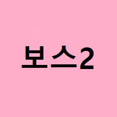
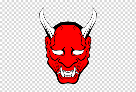

# Shooting Star
## 게임소개

우주를 비행하며, 적을 제거해 나가는 아케이드 장르의 슈팅게임 입니다.

[게임 소개 영상](https://youtube.com)

## 조작 방법

### 이동: →, ←, ↑, ↓
### 공격: a
### 필살기: s

* 필살기는 5개를 초과하여 누적되지 않습니다.
* 필살기를 사용하는 도중에는 적에게 공격받지 않습니다.

## 레벨링 시스템

* 적들을 제거하면 경험치가 누적되게 됩니다. 누적된 경험치에 따라 레벨을 올릴 수 있고, 상승된 레벨에 따라 탄환의 공격력이 상승하게 됩니다.
* 레벨에 따라 등장하는 적의 종류가 변하게 됩니다. 
* 4레벨 이후 부터는 레벨에 따른 궁극기 개수만 추가됩니다.

## 스테이지 구성

### 1 stage Boss

### 2 stage Boss

### 3 stage Boss

### 4 stage 이후
* 1~3스테이지에서 등장한 보스들이 동시에 등장합니다.
* 또한, 적들의 등장주기가 짧아지고 이동속도가 상승되어 난이도가 올라가게 됩니다.

## 실행 방법

[설치파일](./ShootingStar_installer.msi)을 실행해주시고, 정상적으로 설치한 뒤에 실행해 주시면 됩니다.
